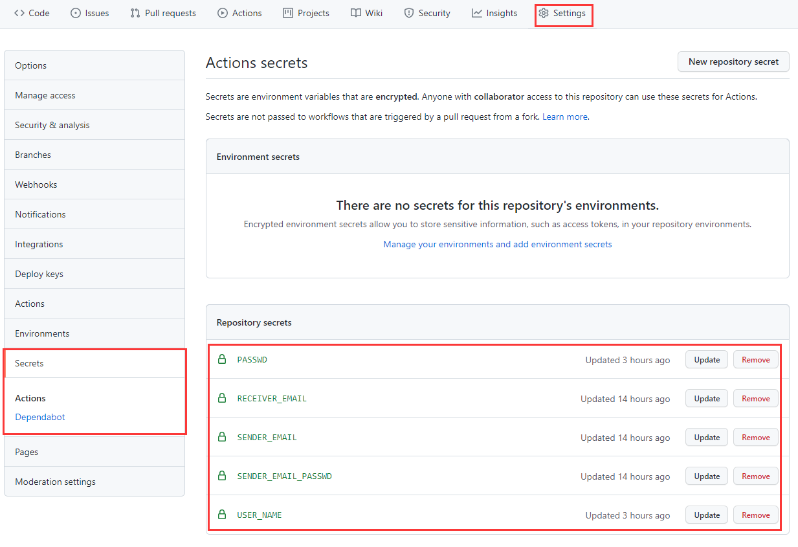

# yqtb
使用方法：
+ `fork`这个仓库
+ fork的仓库 -> `action` -> 打开workflow(**记得点enable workflow这个按钮**)
+ fork的仓库 -> `settings` -> secret -> 设置以下secret
    + `USER_NAME` 翱翔门户账号
    + `PASSWD` 翱翔门户密码
    + `SENDER_EMAIL` 发送方邮件账号(需要打开smtp服务，比如qq邮箱，获得一个秘钥填写到下面这个passwd里面)
    + `SENDER_EMAIL_PASSWD` 发送方邮箱密码
    + `RECEIVER_EMAIL` 接受方邮箱账号

 
  
